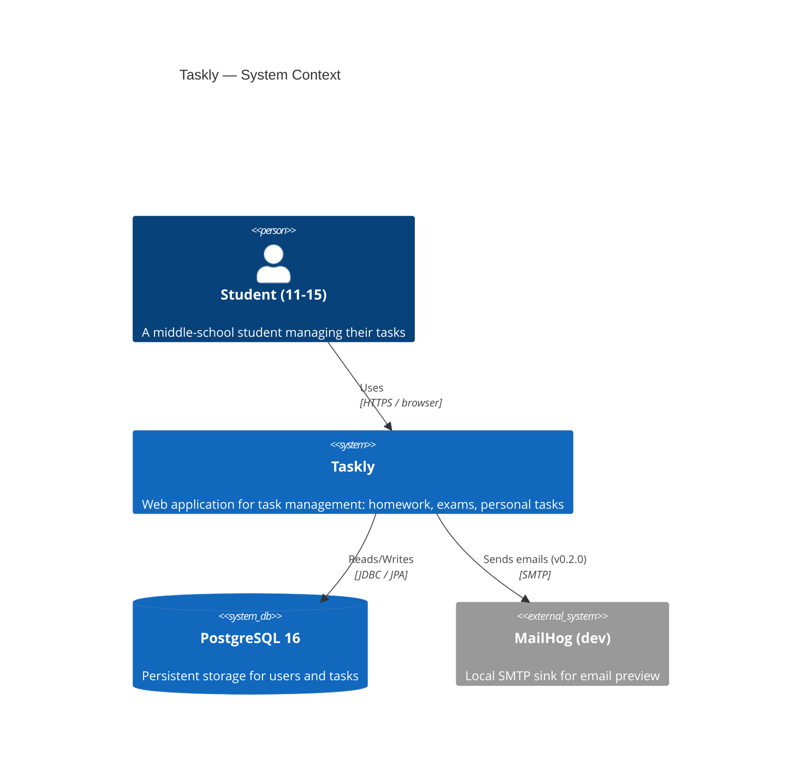
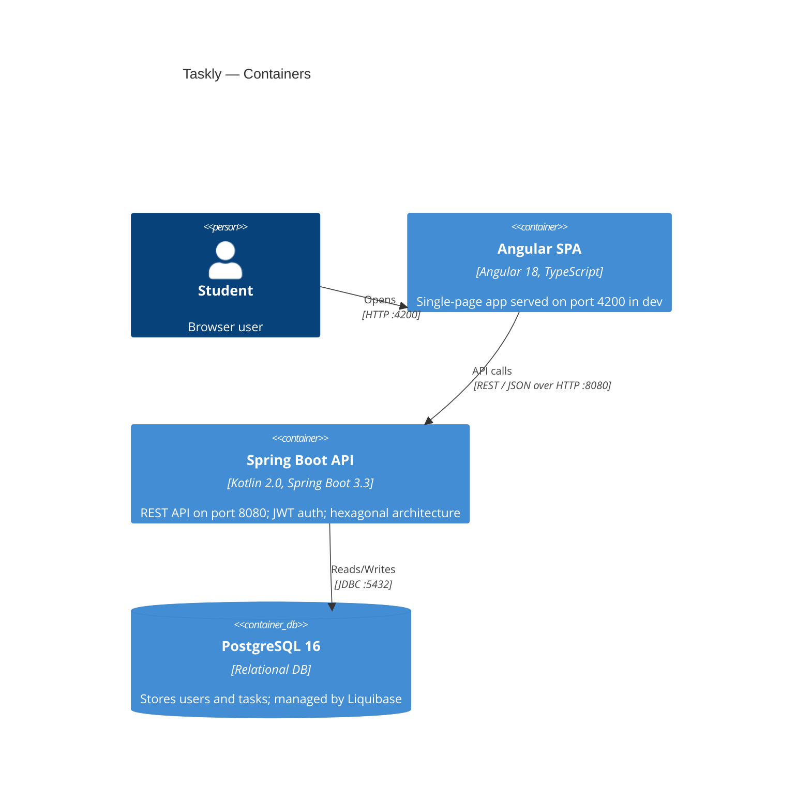
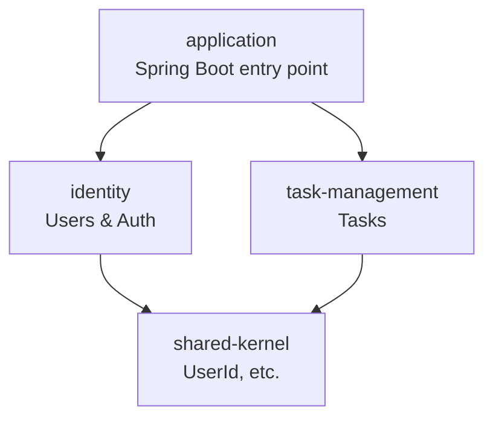

# Taskly Architecture

## C4 Model: Context Diagram



## C4 Model: Container Diagram



## Backend Module Map



## Bounded Context Map

```
┌─────────────────────────────────────┐
│           Identity Context          │
│  User, Email, Password, UserId      │
│  RegisterUser, AuthenticateUser     │
│  JWT Token generation               │
└────────────────┬────────────────────┘
                 │ UserId (shared kernel)
┌────────────────┴────────────────────┐
│       Task Management Context       │
│  Task, Priority, TaskType, Status   │
│  CreateTask, UpdateTask, DeleteTask │
│  ListTasksForUser, MarkAsDone       │
└─────────────────────────────────────┘
```

## Hexagonal Architecture (per module)

```
                    ┌─────────────────────────────────────┐
                    │              Domain                  │
                    │  model/  event/  exception/          │
                    │  port/inbound/   port/outbound/      │
                    └───────────────┬─────────────────────┘
                                    │ interfaces only
          ┌─────────────────────────┼──────────────────────────┐
          │                         │                          │
┌─────────▼──────────┐   ┌──────────▼───────────┐   ┌─────────▼──────────┐
│  REST Controller   │   │  Application Service  │   │  JPA Adapter       │
│  (inbound adapter) │   │  (orchestrates domain)│   │  (outbound adapter)│
└────────────────────┘   └──────────────────────┘   └────────────────────┘
```

## DDD Glossary

| Term | Definition in Taskly |
|------|---------------------|
| **Aggregate** | `User`, `Task`: transactional boundary, consistency enforced within |
| **Value Object** | `Email`, `Password`, `UserId`, `TaskId`, `Subject`, `Deadline`, `EstimatedDuration`: immutable, identity by value |
| **Domain Event** | `UserRegistered`: signals that something meaningful happened in the domain |
| **Use Case (Port)** | Interface in `domain.port.inbound`, e.g., `RegisterUserUseCase` |
| **Repository (Port)** | Interface in `domain.port.outbound`, e.g., `UserRepository` |
| **Application Service** | Implements a use case port, orchestrates domain objects and calls repository ports |
| **Adapter** | Concrete implementation of a port: REST controller (inbound) or JPA repository (outbound) |
| **Bounded Context** | `identity` and `task-management`: each with its own ubiquitous language |
| **Shared Kernel** | `shared-kernel` module: `UserId` shared between contexts |

## Architecture Decision Records

- [ADR-001: Hexagonal Architecture + DDD](architecture/adr/ADR-001-hexagonal-architecture.md)
- [ADR-002: JWT in localStorage for MVP](architecture/adr/ADR-002-jwt-localstorage.md)
- [ADR-003: Liquibase over Flyway](architecture/adr/ADR-003-liquibase.md)
